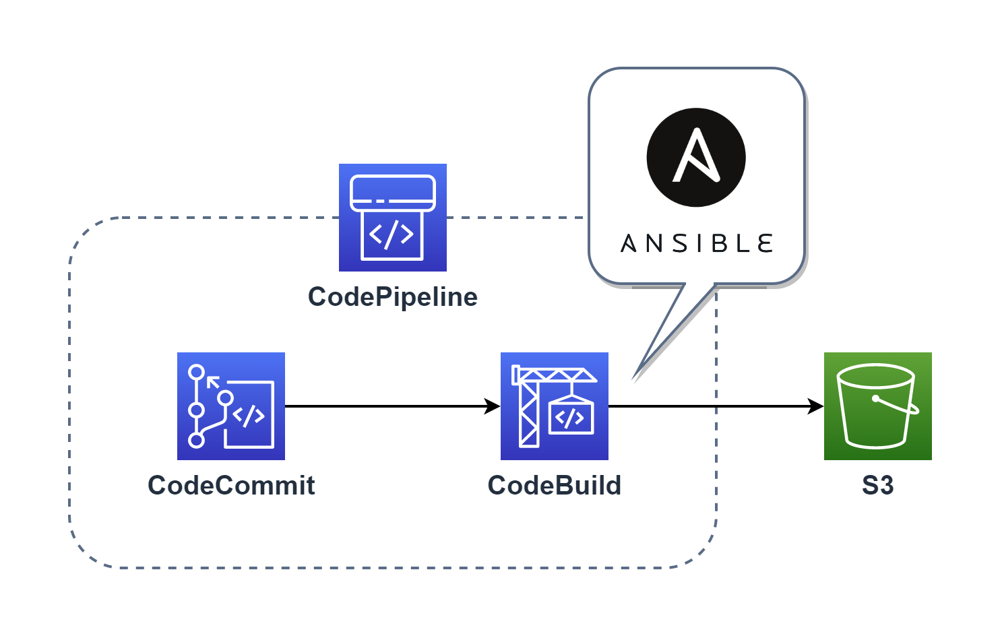
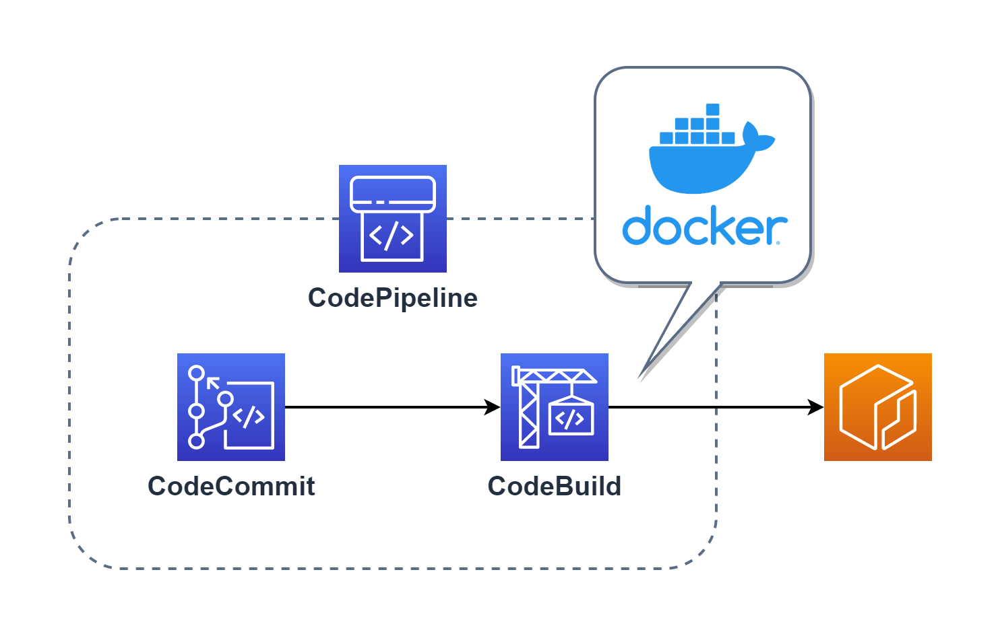
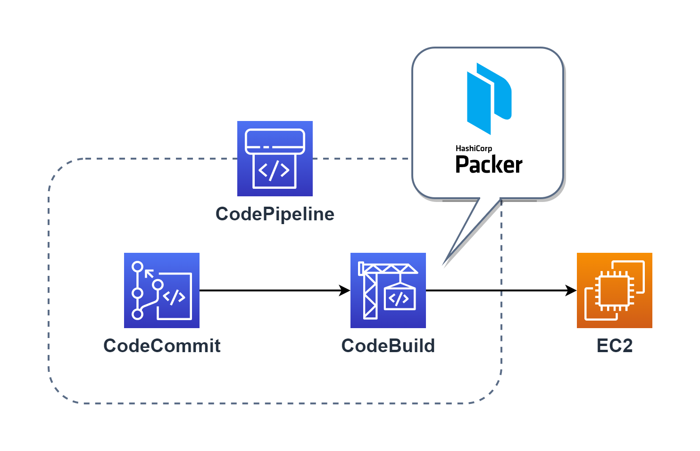
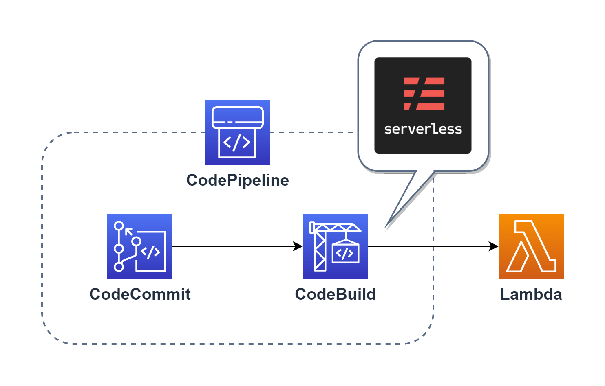
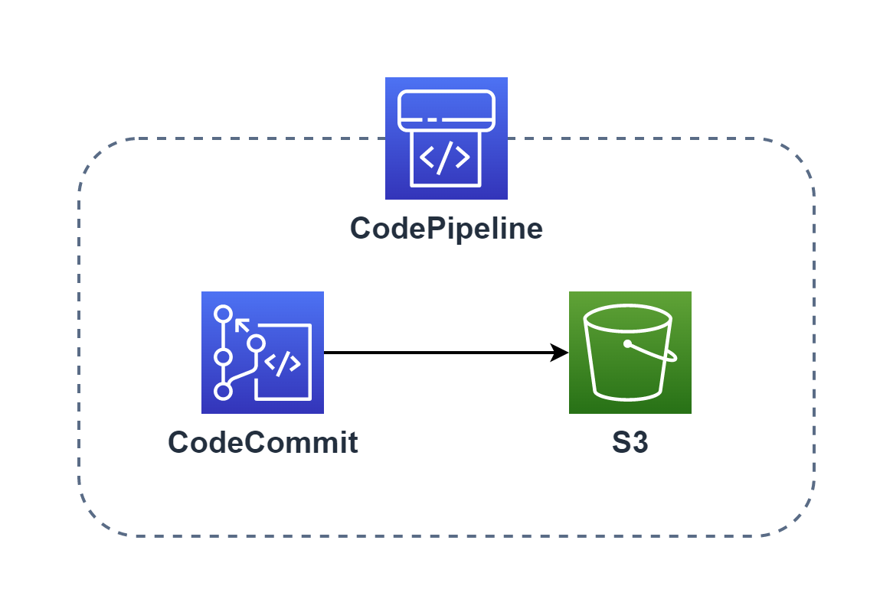

# CodePipeline 用の Terraform

## Variables

Terraform Cloud の Variables に下記変数を指定してください。

- access_key = AWS のアクセスキー
- secret_key = AWS のシークレットキー
- region = AWS のリージョン
- docker_sercrets_arn = Docker Hub のアカウント情報が記載された Secrets Manager の Arn
- ansible_playbook_bucket_name = Ansible Playbook を格納する S3 バケット

Systems Manager パラメータストアの**ACCESS_KEY_ID**と**SECRET_ACCESS_KEY**にアクセスキーとシークレットキーを格納しておいてください。

## Modules

### pipeline_ansible

CodeCommit リポジトリへのプッシュをトリガーに [Ansible Playbook](https://www.ansible.com/) の Zip ファイル S3 に作成する CodePipeline を作成するモジュールです。

- 

下記値を指定してください。

- project_name = プロジェクト名
- codecommit_repo_name = Ansible Playbook をプッシュしている CodeCommit のレポジトリ名

### pipeline_docker

CodeCommit リポジトリへのプッシュをトリガーに [Docker](https://www.docker.com/) イメージを作成し、そのイメージを ECR にプッシュする CodePipeline を作成するモジュールです。

- 

下記値を指定してください。

- project_name = プロジェクト名
- codecommit_repo_name = Packer の実行ファイルをプッシュしている CodeCommit のレポジトリ名
- ecr_repo_name = ECR のレポジトリ名
- deploy_script = デプロイ時のスクリプト

  例）ECS のタスクを置き換えたい場合は下記

  ```sh
  aws ecs update-service --force-new-deployment --cluster <クラスター名> --service <サービス名>
  ```

  プッシュするだけなら Echo コマンド等を指定してください。

  ```sh
  echo 'Docker push successful! Image uploaded to the repository.'
  ```

### pipeline_packer

CodeCommit リポジトリへのプッシュをトリガーに [Pakcer](https://www.packer.io/) を実行する CodePipeline を作成するモジュールです。

- 
- 下記値を指定してください。

- project_name = プロジェクト名
- codecommit_repo_name = CodeCommit のレポジトリ名

### pipeline_serverless

CodeCommit リポジトリへのプッシュをトリガーに [Serverless Framework](https://www.serverless.com/) を実行する CodePipeline を作成するモジュールです。

- 

下記値を指定してください。

- project_name = プロジェクト名
- codecommit_repo_name = CodeCommit のレポジトリ名
- environment_variables = Serverless Framework での環境変数

  例）

  ```
  environment_variables = {
    variables1 = {
      value = "hoge"
    },
    variables2 = {
      value = "huga"
    }
  }
  ```

### pipeline_file

CodeCommit リポジトリへのプッシュをトリガーにファイルを S3 に作成する CodePipeline を作成するモジュールです。

- 

下記値を指定してください。

- project_name = プロジェクト名
- codecommit_repo_name = CodeCommit のレポジトリ名
- bucket_name = デプロイするバケット名
- extract = デプロイするファイルを解凍するかどうか
- object_key = 解凍しない場合は圧縮後のファイル名、解凍する場合はファイルを格納するパスを指定
